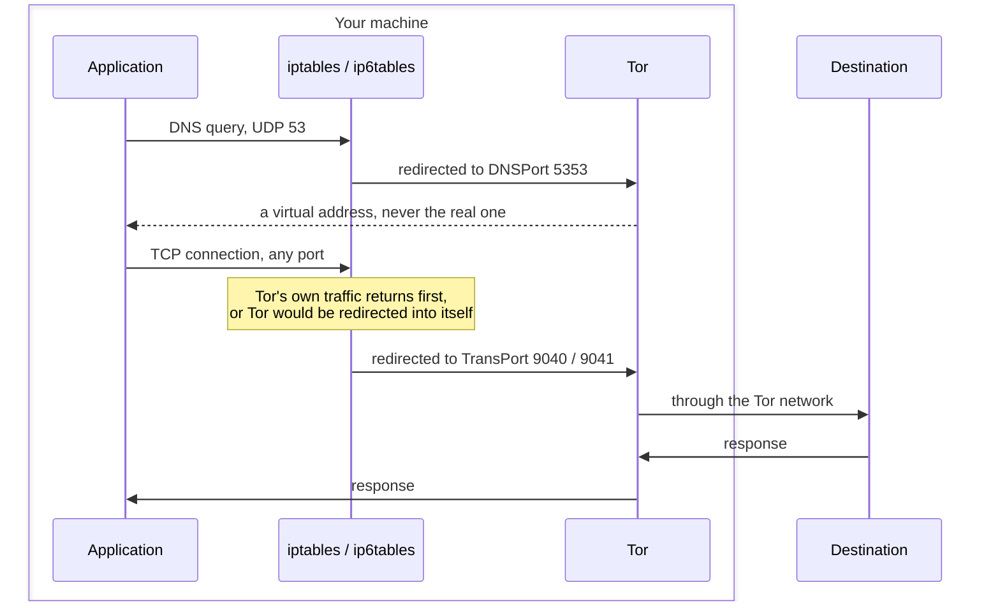

# torcontroller

[](https://github.com/tn00869679/torcontroller/releases/latest)
[](https://github.com/tn00869679/torcontroller/actions/workflows/test.yml)
[](https://codecov.io/gh/tn00869679/torcontroller)
[](https://github.com/tn00869679/torcontroller)

TorController is a CLI tool for [Tor](https://www.torproject.org/) users that
puts a Linux machine's outbound traffic through Tor with one command, and takes
it back out with another.

- **Every TCP port**, not only web traffic. SSH, mail and anything else you run
  goes through Tor, not just ports 80 and 443.
- **DNS through Tor.** Redirection happens when a connection is made, which is
  after the name has already been looked up. Without catching DNS as well, the
  traffic is anonymous but every hostname you visit is still visible to your
  network.
- **IPv6 through Tor**, rather than left to leak. Tor answers AAAA queries too,
  so ignoring IPv6 is not neutral: applications on a dual-stack machine would
  prefer an address that nothing handles.
- **Circuit switching** on demand, and automatically when throughput drops
  below a configured threshold. [More](./docs/setting.md)
- **Linux**, Debian and Ubuntu.

If you are not reading this on github, please go to <https://github.com/tn00869679/torcontroller>

Japanese README: [日本語説明こちら](./READMEJP.md)

## Fork Notice

This repository is a fork of [Seicrypto/torcontroller](https://github.com/Seicrypto/torcontroller)
by Seikan Chin, licensed under the Apache License 2.0. It is maintained
independently by [@tn00869679](https://github.com/tn00869679) and is **not** an
official release of the original project. Files have been modified from the
original — see [NOTICE](./NOTICE) for the list of changes.

## QuickStart

  

**Step 1 — install**

```bash
apt-get update

# Intel / AMD cpu:
wget https://github.com/tn00869679/torcontroller/releases/download/v1.1.0/torcontroller_v1.1.0_amd64.deb
apt-get install -y ./torcontroller_v1.1.0_amd64.deb

# ARM cpu:
# wget https://github.com/tn00869679/torcontroller/releases/download/v1.1.0/torcontroller_v1.1.0_arm64.deb
# apt-get install -y ./torcontroller_v1.1.0_arm64.deb

# Which one do you need? `uname -m` says aarch64 for ARM, x86_64 for Intel/AMD.
```

**Step 2 — check the machine is ready**

```bash
torcontroller check
```

Every line should read `[OK]`. `--fix` repairs what it can. No password setup
is needed: Tor's control port is reached with its authentication cookie, which
is regenerated on every start and readable only by root and the tor user.

**Step 3 — use it**

```bash
curl http://icanhazip.com/
# 89.196.159.79   your real address

torcontroller start
# Response: Done

curl http://icanhazip.com/
# 176.10.99.200   a Tor exit

torcontroller switch    # take a different route out
torcontroller traffic   # bytes read and written so far
torcontroller stop      # remove the rules, back to normal
```

`start` refuses rather than half-working. If Tor is not listening on the ports
the rules point at, no rules are installed at all — redirecting to a closed
port would take the machine off the network with nothing to explain why.

## What torcontroller does



Rules live in a chain of their own, `TORCONTROLLER`, and `OUTPUT` jumps to it
only once the chain is complete. A failure part-way through therefore leaves
nothing behind: the chain is unreachable until the final step.

Loopback and the LAN ranges are exempt, so local services and nearby machines
keep working.

## Configuration

`/etc/torcontroller/torcontroller.yml`. Every key is optional; leave one out
and the built-in default applies.

```yaml
rate_limit:
  min_read_rate: 10000
  min_write_rate: 5000

proxy:
  virtual_net_ipv4: 10.192.0.0/10
  virtual_net_ipv6: fc00::/7
  excluded_nets:
    - 127.0.0.0/8
    - 10.0.0.0/8
    - 172.16.0.0/12
    - 192.168.0.0/16
  excluded_nets_ipv6:
    - ::1/128
    - fe80::/10
  enable_ipv6: true
```

**If this machine has an IPv6 LAN, narrow `virtual_net_ipv6`.** The default
covers `fd00::/8`, where real unique-local networks live, and those addresses
would be routed into Tor instead of reaching your network.

The two `virtual_net_*` values must match `VirtualAddrNetworkIPv4` and
`VirtualAddrNetworkIPv6` in `/etc/tor/torrc`. `start` reads torrc and refuses
if they disagree — a mismatch would send traffic to resolved hosts around Tor
while every connection still appeared to succeed.

Set `enable_ipv6: false` only as a fallback. Tor keeps handing out virtual IPv6
addresses either way, so with it off, applications that prefer an AAAA answer
may fail to connect.

## Optional: privoxy

Traffic no longer passes through privoxy — connections go to Tor directly,
which is what allows protocols other than HTTP to work. It is still configured
to forward through Tor if you want its filtering:

```bash
apt-get install privoxy
export http_proxy=http://127.0.0.1:8118
```

## Upgrading

`torcontroller start` needs settings in `torrc` that earlier versions did not
write. Packaging never overwrites a torrc you may have edited, so the package
runs `torcontroller migrate` on upgrade instead: it appends only what is
missing, leaves everything else untouched, and can be run again safely.

It also removes the control password those versions shipped, which was the same
value on every installation, and retires the `tor.service` they installed —
that unit ran Tor as root, where the rules cannot tell Tor's own traffic apart
from anything else. It is moved to `tor.service.torcontroller-backup` rather
than deleted.

If migration fails the install still completes and says so. `start` will refuse
until it is resolved, so an unmigrated machine loses the feature, not the
network. Run `sudo torcontroller migrate` to see what went wrong.

## Testing

Unit tests need a Linux host — `initializer/sudoersVerify.go` uses
`syscall.Stat_t`, which does not exist on Windows.

```bash
go test ./...
```

The end-to-end test reaches the real Tor network and needs a privileged
container:

```bash
go build -o torcontroller .
docker run --rm --cap-add=NET_ADMIN --cap-add=NET_RAW \
  -v "$PWD:/repo:ro" \
  ghcr.io/tn00869679/torcontroller/torcontroller-test-env:dev \
  bash -c 'apt-get update -qq && apt-get install -y -qq dnsutils tcpdump &&
           bash /repo/scripts/integration-test.sh /repo/torcontroller'
```

It runs weekly in CI rather than on every push: it depends on Tor being
reachable, and a test that fails for reasons unrelated to the code stops being
read.

## Reference

[Tor manual: TransPort, DNSPort and AutomapHostsOnResolve](https://2019.www.torproject.org/docs/tor-manual.html.en)

[privoxy.service file for systemctl](https://alt.os.linux.mageia.narkive.com/D2i3xOYQ/privoxy-service-file-for-systemd)

## Usage Disclaimer

This tool, **Torcontroller**, is developed to help users enhance their privacy and protect their online activities in lawful and ethical ways. It is strictly prohibited to use this tool for unauthorized access, illegal data scraping, or any activities that violate privacy laws (e.g., GDPR, CCPA) or ethical standards.

By using this tool, you agree to comply with all applicable laws and take full responsibility for your actions. The developers are not liable for any misuse or unlawful activities carried out with this tool.
