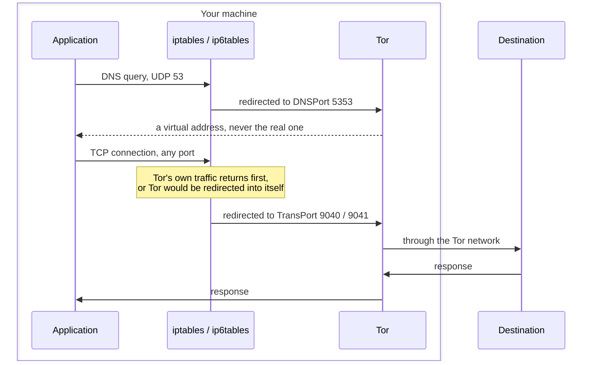

# torcontroller Japanese 日本語説明

[](https://github.com/tn00869679/torcontroller/releases/latest)
[](https://github.com/tn00869679/torcontroller/actions/workflows/test.yml)
[](https://codecov.io/gh/tn00869679/torcontroller)
[](https://github.com/tn00869679/torcontroller)

> **翻訳について**: この日本語版は英語版からの翻訳です。技術的な内容は
> [README.md](./README.md) と同じですが、日本語話者による校閲は受けていません。
> 表現に不自然な点がある場合、正確なのは英語版です。

TorControllerは[Tor](https://www.torproject.org/)ユーザ向けのCLIツールです。
コマンド一つでLinuxマシンの外向き通信をTor経由にし、もう一つのコマンドで元に戻します。

- **すべてのTCPポート**が対象です。80番と443番だけでなく、SSHやメールなど
  実行中のあらゆる通信がTorを経由します。
- **DNSもTor経由**です。リダイレクトは接続時に行われますが、その時点で名前解決は
  既に済んでいます。DNSを捕捉しなければ、通信自体は匿名でも、訪問先のホスト名は
  ネットワークから見えたままです。
- **IPv6もTor経由**にします。TorはAAAAクエリにも応答するため、IPv6を放置することは
  中立ではありません。デュアルスタック環境では、どこにも繋がらないアドレスを
  アプリケーションが優先してしまう可能性があります。
- **回線の切り替え**を任意のタイミングで実行できます。設定した閾値を下回る
  スループットの場合は自動でも切り替わります。[詳細](./docs/setting.md)
- **Linux**（Debian / Ubuntu）に対応しています。

英語版: [README.md](./README.md)

## フォークについて

本リポジトリは、Seikan Chin 氏による [Seicrypto/torcontroller](https://github.com/Seicrypto/torcontroller)
を Apache License 2.0 のもとでフォークしたものです。[@tn00869679](https://github.com/tn00869679)
が独自に保守しており、オリジナルプロジェクトの公式リリースでは**ありません**。
オリジナルからの変更点は [NOTICE](./NOTICE) を参照してください。

## クイック・スタート

  

**ステップ1 — インストール**

```bash
apt-get update

# Intel / AMD cpu:
wget https://github.com/tn00869679/torcontroller/releases/download/v1.1.0/torcontroller_v1.1.0_amd64.deb
apt-get install -y ./torcontroller_v1.1.0_amd64.deb

# ARM cpu:
# wget https://github.com/tn00869679/torcontroller/releases/download/v1.1.0/torcontroller_v1.1.0_arm64.deb
# apt-get install -y ./torcontroller_v1.1.0_arm64.deb

# どちらが必要か: `uname -m` が aarch64 なら ARM、x86_64 なら Intel/AMD です。
```

**ステップ2 — 環境を確認する**

```bash
torcontroller check
```

すべての行が `[OK]` になっていれば準備完了です。`--fix` を付けると修復できる項目を
修復します。パスワードの設定は不要です。Torの制御ポートへの認証には認証クッキーを
使います。クッキーは起動のたびに再生成され、rootとtorユーザだけが読めます。

**ステップ3 — 使う**

```bash
curl http://icanhazip.com/
# 89.196.159.79   実際のアドレス

torcontroller start
# Response: Done

curl http://icanhazip.com/
# 176.10.99.200   Torの出口ノード

torcontroller switch    # 別の経路に切り替える
torcontroller traffic   # これまでの送受信バイト数
torcontroller stop      # ルールを削除して元に戻す
```

`start` は中途半端に動作するより拒否します。ルールが指すポートでTorが待ち受けて
いない場合、ルールは一つも設定されません。閉じたポートへリダイレクトすると、
理由も分からないままマシンがネットワークから切り離されるためです。

## torcontrollerの動作



ルールは専用のチェイン `TORCONTROLLER` に置かれ、チェインが完成してから初めて
`OUTPUT` がそこへジャンプします。そのため途中で失敗しても何も残りません。
最後の手順を終えるまで、そのチェインには到達しないからです。

ループバックとLANの範囲は除外されるので、ローカルのサービスや近隣のマシンには
これまで通り接続できます。

## 設定

`/etc/torcontroller/torcontroller.yml` です。すべての項目は省略可能で、
省略した場合は既定値が使われます。

```yaml
rate_limit:
  min_read_rate: 10000
  min_write_rate: 5000

proxy:
  virtual_net_ipv4: 10.192.0.0/10
  virtual_net_ipv6: fc00::/7
  excluded_nets:
    - 127.0.0.0/8
    - 10.0.0.0/8
    - 172.16.0.0/12
    - 192.168.0.0/16
  excluded_nets_ipv6:
    - ::1/128
    - fe80::/10
  enable_ipv6: true
```

**IPv6のLANがある環境では `virtual_net_ipv6` を狭めてください。** 既定値は実際の
ユニークローカルアドレスが使う `fd00::/8` を含むため、そのままではLANのアドレスが
Torへ送られ、到達できなくなります。

`virtual_net_*` の2つの値は `/etc/tor/torrc` の `VirtualAddrNetworkIPv4` と
`VirtualAddrNetworkIPv6` に一致している必要があります。`start` は torrc を読み、
食い違っていれば拒否します。不一致の場合、名前解決したホストへの通信はTorを
迂回しますが、接続自体は成功してしまうためです。

`enable_ipv6: false` は最後の手段としてのみ使ってください。どちらの設定でもTorは
仮想IPv6アドレスを返すため、無効にするとAAAA応答を優先するアプリケーションが
接続できなくなる可能性があります。

## 任意: privoxy

通信はprivoxyを経由しなくなりました。Torへ直接接続することが、HTTP以外の
プロトコルを扱えるようにしている理由です。フィルタリング機能が必要な場合は、
Torへ転送する設定のまま残してあります。

```bash
apt-get install privoxy
export http_proxy=http://127.0.0.1:8118
```

## アップグレード

`torcontroller start` には、以前のバージョンが書いていなかった設定が `torrc` に
必要です。パッケージは利用者が編集したかもしれない torrc を上書きしないため、
代わりにアップグレード時に `torcontroller migrate` を実行します。不足している
項目だけを追記し、他はそのまま残します。再実行しても安全です。

同時に、以前のバージョンが同梱していた制御パスワード（全インストールで同一の値
でした）を削除し、当時インストールされた `tor.service` を退避します。そのユニットは
Torをrootで実行するため、ルールがTor自身の通信を区別できなくなります。削除ではなく
`tor.service.torcontroller-backup` へ移動します。

移行に失敗してもインストール自体は完了し、その旨が表示されます。解決するまで
`start` は拒否するので、移行されていないマシンは機能を失うだけでネットワークは
失いません。`sudo torcontroller migrate` を実行すると失敗の内容が分かります。

## テスト

ユニットテストにはLinux環境が必要です。`initializer/sudoersVerify.go` が
Windowsには存在しない `syscall.Stat_t` を使っているためです。

```bash
go test ./...
```

エンドツーエンドのテストは実際のTorネットワークに接続するため、特権コンテナが
必要です。

```bash
go build -o torcontroller .
docker run --rm --cap-add=NET_ADMIN --cap-add=NET_RAW \
  -v "$PWD:/repo:ro" \
  ghcr.io/tn00869679/torcontroller/torcontroller-test-env:dev \
  bash -c 'apt-get update -qq && apt-get install -y -qq dnsutils tcpdump &&
           bash /repo/scripts/integration-test.sh /repo/torcontroller'
```

CIではpushのたびではなく週次で実行しています。Torへ到達できるかに依存するため、
コードと無関係な理由で失敗するテストは読まれなくなるからです。

## 参考

[Tor manual: TransPort, DNSPort and AutomapHostsOnResolve](https://2019.www.torproject.org/docs/tor-manual.html.en)

[privoxy.service file for systemctl](https://alt.os.linux.mageia.narkive.com/D2i3xOYQ/privoxy-service-file-for-systemd)

## 利用上の免責事項

本ツール **Torcontroller** は、利用者が合法的かつ倫理的な方法でプライバシーを強化し、オンライン活動を保護できるよう開発されています。不正アクセス、違法なデータ収集、プライバシー関連法（GDPR、CCPA など）や倫理基準に違反する行為への使用は固く禁じます。

本ツールを使用することにより、適用されるすべての法令を遵守し、自らの行為について全責任を負うことに同意したものとみなされます。開発者は、本ツールを用いた誤用または違法行為について一切の責任を負いません。
